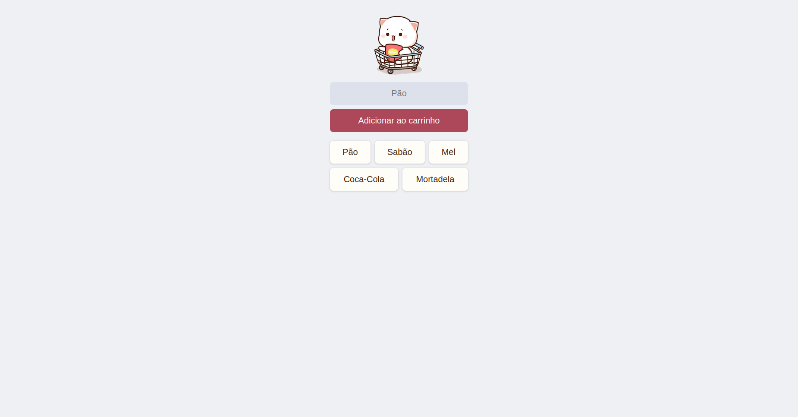

# Scrimba Mobile App

This project is a grocery shop mobile app (PWA) built as part of the [Scrimba's Learn JavaScript course](https://v2.scrimba.com/learn-javascript-c0v). Users can add items to their shopping list and click on them to remove when they are no longer needed. 
The app uses Firebase Realtime Database to store the items so that the shopping list is updated in real-time across all devices.

 

## Technologies Used
- HTML
- CSS
- JavaScript
- Firebase (Realtime Database)